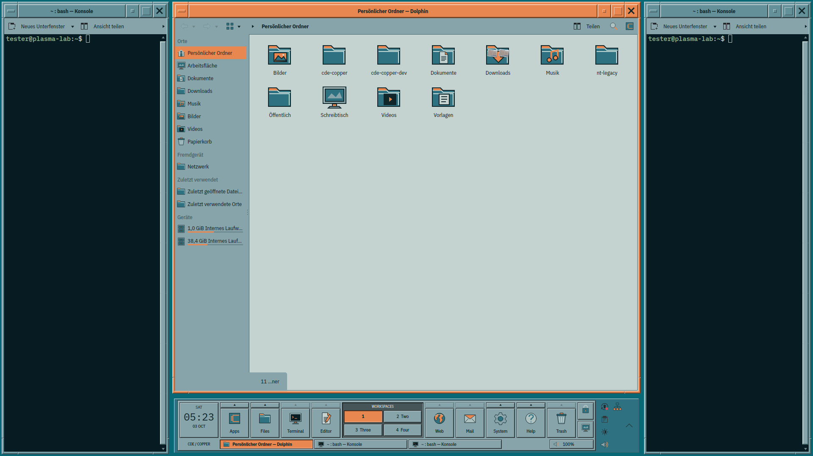
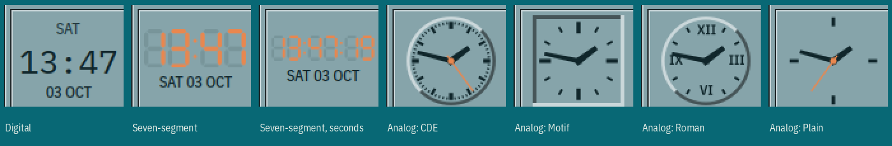

# CDE Copper

A contemporary CDE/Motif workstation theme for KDE Plasma 6.



The handoff's teal and copper palette meets a more traditional CDE silhouette:
a compact bottom front console, mwm window frames, square Motif controls,
hard bevels and original vector workstation icons. Copper identifies the active
window, selected workspace and focused controls. The desktop stays quiet teal,
or takes any of CDE's own 37 palettes and backdrops, or one of ten dark
palettes of our own.

The console, its settings, the start-up, lock and logout screens speak
German where the system does (gettext domain `cde-copper`, `po/`); other
languages can be added as `po/<language>.po`.

## Included

- KDE color scheme and 38 Plasma surface SVGs.
- Window frame after mwm/dtwm, as a QML Aurorae decoration: raised resize frame
  with separate corner handles, title bar of individually shadowed parts (window
  menu bar, title, minimize, maximize, close), title and client together in a
  sunken well. Its colours come from the active
  colour scheme and its shadows from Motif's own shading rule, so it follows
  every palette. Title-bar height is adjustable; the buttons scale with it.
  A short hard shadow at the right and bottom (switchable in the Style
  Manager › Window or the decoration's settings); inactive frames have a flatter
  bevel.
- Kvantum widget style with Motif controls: bevelled buttons, sunken fields,
  diamond radio buttons, copper focus frame, default button and selection,
  bevelled scrollbars with arrows, attached tabs and hard-edged menus.
- IBM Plex Sans Condensed for the interface and titles (semibold), IBM Plex
  Mono for Konsole and fixed-width text; both ship with the theme (SIL OFL).
- The front console (one per screen, at any screen edge): clock with a month
  calendar and the day's appointments, configurable launcher tiles with
  subpanels, an Applications menu with cascading categories (also on the
  Meta key; typing there searches the applications, so Meta, "kons",
  Return starts Konsole), the browser's
  bookmarks, the editor's (or LibreOffice's) recently opened files, a Mail
  subpanel (new message, appointments, address book), Places and System
  subpanels, saved window layouts with previews, workspace switcher (its own settings page: one to eight
  workspaces, button width, a label per workspace, or switched off; each button in a colour of the palette,
  as in CDE), window task strip (several windows of
  one application as one button, "3× Konsole"), or instead a window tile
  beside the launchers, window icons under each workspace or a pager with each
  workspace in miniature, volume
  control, and a launcher-wide block: its arrow strip opens the hidden tray
  icons, below it small square buttons, two to a column, chosen under Front
  Console › Small buttons: console settings (faders, apart from System
  Settings' gear), lock screen, show desktop, a load meter (processor and
  memory from Plasma's own sensors; a click opens the system monitor; on a
  laptop the battery joins it as a third reading, by default only while
  running on the battery, or always, or never, under Tiles › Battery), volume
  (click for the slider, wheel to change it; unchosen it sits in the strip's
  row), network (WLAN signal, cable or offline; a click opens a list of the WLANs
  around: one click joins a network, Plasma asking for a new one's passphrase,
  a click on the one in use disconnects it; WLAN on/off and the connection
  settings below) and leave session. The optional LLM cluster button shows the
  combined generation tokens per second; a click lists each host, its state
  and a bar relative to the session peak. Enable it under Tiles › Small
  buttons. Independently, a launcher whose program is “LLM cluster” shows a
  full-size tile in its place (anywhere in either list); both displays can be
  enabled together. Its
  arrow and tile open the same popup, also with Tab and Enter or Space from
  the keyboard (Escape closes it). Launcher labels also control its “LLM”
  caption. Polling runs while either display is visible, using one timer.
  Set the comma-separated LLM hosts under Tiles › Advanced (empty by
  default; for example `desk=http://127.0.0.1:8080,server=ssh:8080`).
  Use `name=http://host:port` for direct HTTP or `name=ssh:PORT` for
  passwordless SSH with curl on the host. Python 3.11 or newer is required
  locally; no monitoring tool or remote Python is needed. Every three seconds
  while visible, it reads `/slots` and calculates tokens per second from
  decoded-counter deltas, discarding resets; `/metrics` is the fallback using
  completed-request token/time deltas. The first sample is zero. Counter
  history is stored atomically in `$XDG_RUNTIME_DIR/cde-llmverbund/state.json`
  (fallback: `/tmp/cde-llmverbund-$UID/`), with private directory/file modes.
  Only backend ports belong in the list. Ports a probe must never touch (a
  socket-activated proxy that would start the model) go into
  `~/.config/cde-copper/llm-guarded` as `host:port`, one per line; they are
  rejected even when configured.
  Invalid entries are ignored; unreachable nodes contribute zero. The Plasma system tray
  stays in the console's panel for notifications, but by default it is out of
  sight: its entries open from the console's button; the tray's own volume
  icon is left out, since the console has one, and so are the entries the
  console covers itself (the network entry, with the network button chosen)
  or that are set up once and never opened again (weather, input methods,
  screen layout, vaults). They are switched off in the tray's settings and
  come back when "Status icons only behind the console's button" is switched
  off; one you switch on again there stays on. The popup's heading is a
  title bar in the palette's selection colour, as on the console's own
  subpanels, and the popup is only as tall as its grid of entries (Plasma
  keeps it at 24 by 24 grid units, half of it empty); an entry's own view
  (notifications, KDE Connect) opens at Plasma's size again. Its title
  and the entries take the console's measures: the title in the console's
  type as on a subpanel, icons and names as on a subpanel's entries. With
  "Icons only in the status popup" (Tiles page) the entries lose their
  names, the icons shrink to small-button size in cells the height of a
  subpanel's row, the grid takes the columns that leave the fewest empty
  cells (thirteen entries: five by three) and the popup no more width
  than they need, under the short title "Status"; each name goes to its
  tooltip. By default the console stands by
  itself; the panel's own frame around it can be switched on.
- CDE's 37 colour palettes and ten dark ones of our own (`palettes/copper/`,
  among them Graphite in greys and Darkroom with red text), shaded with
  Motif's algorithm, and CDE's 25 desktop
  backdrops, coloured with the chosen palette.
- A window arrangement around the console: terminals left and right, the main
  window in the middle above the console (Meta+Ctrl+C), and sets of three,
  four or seven terminals opened in their places from the Terminal subpanel.
- Mouse cursors after the X11 cursor font of CDE and Motif (arrow, I-beam,
  wristwatch, hand, crosshair, resize arrows...), 28 drawings under 99 names,
  pixel-exact at 24, 32, 48 and 64 px: slim black shapes on a coloured rim
  (copper, the palette's accent, white or any colour, chosen in the Style
  Manager › Pointer) with a soft shadow.
- Original SVG icon artwork, 248 drawings under 652 names (applications,
  menu categories, actions, documents, devices, places, battery, network and
  other status icons), with no embedded raster images; the 59 most visible
  also as pixel versions for 16 and 22 px. Drawn in Copper's colours and
  recoloured with every palette, as CDE's icons took the palette's dynamic
  colours: outline, body, paper, dark accent and copper accent come from
  the palette, with a contrast floor against the console face and the text
  fields (on dark ones the bodies turn light, the outline stays dark).
  Monochrome "-symbolic" icons are coloured by Plasma itself.
- Konsole profile and color scheme, global-theme bundle with a Motif start-up
  screen, and teal wallpaper. A second global theme, CDE Night (CDE's
  NorthernSky palette), is set as the night theme of Plasma's day/night
  switching (Quick Settings), CDE Copper as the day theme; the console
  follows each switch with its controls, surfaces and desktop colour.
- CDE's lock screen: a Motif dialog on the palette's backdrop. Plasma 6 takes
  the lock screen from its shell package, so it comes as a shell package of
  its own (org.cde.copper.shell) that takes everything else from Plasma's;
  applying the theme switches to it, moving the panel and desktop
  configuration along (Style Manager › Lock Screen switches back). It talks to
  the authenticator as Plasma's lock screen does (one entry per prompt, a
  short wait after a failure, fingerprint readers left alone). Global
  themes other than CDE's, applied with their layout while this shell
  runs, get Plasma's default panel from the shell's own default layout.
  A small systemd path unit (cde-copper-theme.path, set up by apply and
  removed by uninstall) lets the shell follow the global theme: switching
  to another global theme goes back to Plasma's shell and, if the layout
  was replaced, loads that theme's own layout there (NT Legacy's taskbar,
  Breeze's panel); switching back to CDE returns to CDE's shell.
- A GTK 3 and GTK 4 theme (CDECopper) from the same palette, so GTK
  programs such as Firefox or PCManFM get the Motif controls too; it is
  rebuilt with every palette. Libadwaita programs ignore GTK themes and only
  take Plasma's colours.
- System parts, installed apart with `sudo python3 system.py install` (and
  undone with `uninstall`): a Plymouth boot splash (a Motif dialog with a
  meter on the backdrop, the passphrase prompt of an encrypted disk in it)
  and a GRUB theme (the menu in a Motif window with a copper title bar, on
  one of the theme's pictures or the backdrop). Plymouth needs its script
  module (Fedora: plymouth-plugin-script); under Secure Boot GRUB loads no
  font files, so the menu then uses GRUB's own Unifont. Both take the
  colours of the palette you applied (`--palette` picks another); after
  switching palettes, run `install` again. GRUB keeps its graphics mode
  for the kernel (gfxpayload=keep), and its console, which it shows while
  loading the system, sits in the menu window instead of a black box over
  the screen (in the window colour where GRUB can colour it, black under
  Secure Boot).
- The login screen of the Plasma Login Manager (plasmalogin, Fedora 44 and
  Nobara), as the third system part. Its layout is compiled into the
  greeter and cannot be replaced; system.py gives it the CDE backdrop
  (Lattice, filled to the largest screen and shown unscaled, or a picture
  with `--login-background`), CDE's Plasma surfaces (the Motif field with
  the copper focus frame), the palette's colours and IBM Plex. It writes
  the greeter's wallpaper into /etc/plasmalogin.conf (the greeter takes the
  image only from there, not from plasmalogin.conf.d) and the greeter
  user's kdeglobals and plasmarc, all backed up and restored by
  `uninstall`. "Apply Plasma settings" on System Settings' login screen
  page overwrites the greeter's colours; run `install` again afterwards.
- CDE's logout confirmation: a Motif dialog with lock, sleep, hibernate,
  restart, shut down and log out, the action it was called for as default
  button and a countdown, in the palette's colours.
- User-only installer, ownership manifest and configuration rollback.

## Install

Requires Plasma 6 / Qt 6, Aurorae, Python 3, `kbuildsycoca6`, Plasma apply
utilities, `qdbus-qt6` or `qdbus6`, and the Plasma 5 Support executable data
engine. Tested on Fedora 44 (Plasma 6.7) and Kubuntu/Ubuntu 26.04 (Plasma 6.6).
The Motif controls need the Kvantum style engine (package `kvantum`, on
Ubuntu `qt6-style-kvantum`);
without it the installer falls back to the built-in Qt Windows style and says
so. The fonts are installed per user and need `fc-cache`. Network/audio status uses NetworkManager's
`nmcli` (a connection it does not manage shows by the default route) and
WirePlumber's `wpctl`. Launchers start `gtk-launch` or `kstart`;
appointments in the calendar come from KOrganizer/Akonadi when installed.
Saved layouts use PyGObject (`python3-gobject`), Spectacle for the preview
and `kdialog` for the name.

To see beforehand which optional parts are missing and what stays empty
without them, run `python3 manage.py check` (the installer and `--dry-run`
print the same list).

The release archive contains ready-built assets. From its extracted directory:

```sh
bash install.sh --dry-run
bash install.sh
bash apply.sh --panel
```

When Plasma is running, `install.sh` offers to restart it so the front console
loads its new code; `--restart-shell` restarts it without asking. Log out and
back in after applying. `--panel` explicitly replaces the current
panel layout with one console per screen (the system tray beside the first);
the installer backs up the previous layout first. Without that flag, your
current panels stay in place. The front console can also be added as a widget
through Plasma's normal widget picker.

### KDE Store edition

System Settings › Global Theme › "Get New…" installs a single global theme
package and runs nothing, so the store carries CDE Copper as several entries:
the global themes (day and night) name the others as dependencies (console,
backdrop, Plasma style, window frame, colour schemes, icons, cursors, window
arrangement script, Alt+Tab switcher), and KDE fetches them with the theme.
Tick "Desktop and window layout" when applying to get the front console.

The store edition is a subset of the theme:

- Breeze widgets instead of the Kvantum Motif controls (an archive for
  Kvantum Manager is offered separately);
- Plasma's lock screen instead of CDE's (that needs a shell package of its
  own, which the store cannot install);
- the 37 palettes as colour schemes, but no style manager: the Plasma
  surfaces follow the colour scheme, the window frame stays Copper (or
  Northern Sky at night); the console's System › Style Manager… opens
  System Settings › Colours instead;
- an SVG window frame drawn after the QML one (the store installs only SVG
  Aurorae frames): no corner grooves, and the window's icon on the menu
  button;
- the number of workspaces is not set (a global theme cannot set it).

`python3 store.py` builds the archives in `dist/store/<version>/` with an
`UPLOAD.md`: the category and title of each entry, and how the store ids go
into `store-ids.json` so that a second run writes the dependencies.

### CDE palettes and backdrops

The 37 palettes of CDE and the ten of our own are listed in **System Settings › Colours** as
"CDE Alpine" … "CDE Wheat", beside "CDE Copper". Choosing one there is enough:
the console notices the new colours and brings the rest along, the Plasma
surfaces, the Kvantum controls and the backdrop. Applications that are already
open take the new controls when restarted; a notification says so.

The **Style Manager** does the same, after CDE's dtstyle: a window of its
own (System subpanel › Style Manager…, or `plasmawindowed
org.cde.copper.stylemanager`) with a row of large buttons, each opening the
dialog of one part of the desktop's style: **Palette** (every palette as
colour stripes), **Backdrop** (the patterns and pictures beside a preview,
pixel size, pattern colour), **Window** (the frame's shadow), **Pointer**
(the cursors' rim), **Lock Screen** (CDE's or Plasma's) and **Controls**
(progress bars outlined, floating in the groove, or slim). OK or Apply
runs the theme's tool at once; the window shows what it is doing, and
after a change to the programs' style it names the open programs that keep
the old style until they are restarted: Qt programs without KDE's platform
theme, GTK 4, Chromium and Electron, X11 and Motif programs. KDE programs
and GTK 3 programs follow at once; Flatpak and libadwaita programs keep
their own look either way. These settings concern the whole desktop, not
the console, so they are not in the console's settings. In System Settings ›
Application Style the controls are listed as "CDE".

**XFile**, a Motif file manager (fastestcode.org, MIT licence), is the closest
thing to CDE's own dtfile on a current system: Motif widgets, bevels shaded
from the background like CDE's, an icon view and a path field. It is not
packaged by the distributions; built from source (it needs only X and Motif),
it joins in by itself: with every palette change the tool writes its X
resources (`~/XFile`: the palette's window, field and selection colours,
IBM Plex, the desktop's terminal, `xdg-open` for files) and, if the
installation brought no menu entry, adds one. A `~/XFile` of your own is left
alone (the theme marks its file in the first line). In the console, choose
"XFile (Motif, as CDE's dtfile)" for the Files tile; its Places subpanel then
opens in XFile too (the trash stays the desktop's, XFile has none).

CDE's 25 backdrops are a wallpaper type of their own: desktop settings ›
Wallpaper type **CDE Backdrop**, a grid of the patterns in the palette's
colours, a pixel size for 200 % screens and the colour behind the pattern.
They are tiled pixel for pixel; Plasma's picture wallpaper would scale the
small patterns up into a blur. Beside CDE's patterns it offers twenty seamless
material tiles (felt, cork, slate, linen, perforated sheet ...; see
`wallpapers/README.md`), each offered tinted with the palette like the patterns
and once more in its natural colour. As in CDE, every workspace can have a backdrop
of its own ("A backdrop for each workspace"): Plasma itself knows wallpapers
per screen and activity only, so the wallpaper follows the current virtual
desktop by itself.

CDE draws its two-colour patterns (BrickWall, Pebbles ...) in white or black on
the desktop colour, so under a dark palette such as Amber they look black and
white. The Style Manager › Backdrop can draw them on dark palettes in the
palette's most colourful light colour instead (Amber's amber, DeepSea's
turquoise); off by default, `--pattern-colour palette|cde` from a shell.

40 picture wallpapers come along in 3840×2160, each with a dark version that
Plasma shows on its own while a dark colour scheme is active:

- **Copper Altai, Canopée, Cluster, Fluss, Kaskade**: low-poly landscapes after
  Plasma's own Altai, Canopée, Cluster, Flow and Cascade, in Copper's teal and copper.
- **CDE Monolith, Polarlicht, Mesa, Riff, Origami, Bauhaus, Weinberg, Orbit**:
  one CDE palette each, from Default to Neptune.
- **CDE Chipstadt, CAD, Molekül, Sequenz, Druckvorstufe, Schnittplatz, MRT,
  Mischpult, VLSI, Strömung**: what CDE workstations were used for in the 1990s.
- **CDE Kristall, Marmor, Düne**: abstract, after the most popular KDE Store wallpapers.
- **CDE Aquarell, Panorama**: late-1990s software box illustration.
- **CDE Düne links/rechts, Weltraum links/rechts**: panoramas split across a 32-inch
  and a 27-inch screen (`wallpapers/gen/span.py` cuts them for other screens).
- **CDE Alpen, Dolomiten, Elbsandstein, Fjord, Island, Schwarzwald, Toskana, Watt**:
  landscape photographs, by day and by night.

All but Strömung are AI-generated decoration without logos or lettering;
Strömung is a computed potential flow around an airfoil.
`wallpapers/README.md` records how each was made.

They are backdrops too: the Style Manager › Backdrop and the "CDE Backdrop"
wallpaper list them after the patterns, the ones painted for the chosen
palette first, and "A backdrop for each workspace" takes pictures as well as
patterns (`--backdrop picture:origami` from a shell). Under a dark palette
the dark version is shown.

The same from a shell:

```sh
python3 manage.py palettes                        # list both
bash apply.sh --palette Broica                    # one of CDE's palettes
bash apply.sh --palette Copper --backdrop Pebbles
bash apply.sh --backdrop none                     # plain palette colour again
python3 ~/.local/share/cde-copper/tool/manage.py palette --palette Lilac --backdrop WaterDrops
```

The last form uses the copy of the tool that the installer puts into the
profile; it needs no extracted archive.

A palette recolours everything: colour scheme, Plasma surfaces, Kvantum
controls, window frames, the console (CDE colour set 8) and, as in CDE, the
backdrop (set 3). Its Plasma surfaces and Kvantum style are generated when it
is applied and replace those of the previously applied palette. Text colours
are chosen for contrast: every text/background pair of every palette reaches
at least 4.5:1, where Motif's fixed threshold would put white on several
mid-tone surfaces.

## Configure the console

The clock tile offers thirteen faces on its settings page: digital type,
seven segments, analog dials, and ten displays drawn after the real thing
(red LED matrix, flip clock, three VFD looks, flip-disc, Panaplex, odometer
drums, pixel type in the palette, plasma screen).

Right-click the console and choose its settings. They survive a change of
global theme or a panel rebuild: every value is mirrored into
`~/.config/cdecopperrc`, and the layout script hands it to the new console.

- **Front Console**: bottom, top, left or right screen edge (upright at the
  sides, running the full screen height, subpanels opening towards the middle);
  Always Visible, Auto-hide / Edge Reveal, or Dodge Windows; floating with a
  gap or sitting on the screen edge; one console for all screens (default,
  its window list shows the windows of every screen) or one on every screen
  (each lists its own screen's windows, or all of them); whether the
  tray's volume icon is left to the console; hard
  contrast (pure black text, white on dark surfaces, labels in semibold);
  label; size
  (75–200 %, tiles, icons and text scale together).
- **Launchers**: the tiles left and right of the workspace switch. Each tile has
  a label, an icon, a program and the subpanel its arrow opens (Applications,
  Places, System, Help, Mail, Terminals, Layouts, Bookmarks, Recent files).
  Programs are
  "Default web browser", "Default mail client", "Default file manager",
  PCManFM (the Files tile's default: PCManFM-Qt takes the Motif controls,
  else the GTK PCManFM, else the desktop's file manager), XFile,
  "Default text editor", terminal, calendar and so on, which follow
  System Settings › Default Applications, or an installed application picked
  from a list, or any command. A tick or a warning shows whether the program is
  installed. When the default is missing, a tile falls back to common
  alternatives (for the browser: Firefox, Chromium, Falkon, Konqueror, ...); if
  nothing is there, it shows a notification instead of failing silently.
- **Clock and Calendar**: clicking the clock shows a month view with the day's
  events, or starts the calendar application right away; which application
  ("@calendar": Merkuro or KOrganizer) and which event sources (appointments,
  holidays, astronomical events, alternate calendars).

**Bookmarks** (the Web tile's arrow) come from the browser the tile starts:
Firefox and LibreWolf, Chromium, Chrome, Brave, Vivaldi, Edge, Falkon and
Konqueror; the toolbar first. **Recent files** (the Editor tile's arrow) are the
files that tile's program opened last, collected from Plasma's activity
database (KDE programs such as Kate and KWrite), `recently-used.xbel` (GTK
programs) and LibreOffice's own list, split by module: a Writer tile shows text
documents, a Calc tile spreadsheets. Choosing another program in the settings
proposes the matching subpanel.

The volume button: click for a slider, Mute and the audio settings; the mouse
wheel changes the volume directly.



**Clock and Calendar** also chooses the clock display: digital, seven-segment
(unlit segments faintly visible, both that and a black edge round the lit
ones can be switched)
or analog with one of four dials: CDE (round,
after CDE's own front-panel clock), Motif (a square sunken well), Roman
numerals, or plain marks on the tile. Seconds can be shown on every display.
The dial takes the text-field colour, hands and digits the text colour, the
second hand and lit segments the selection colour, so every palette dresses
the clock to match. All sizes follow the tile, so the clock fits at 75 % and
in the upright console.
The Panaplex gas-discharge display comes twice: in its own orange, and glowing
in the palette's selection colour (lifted to a glow under dark palettes).

Subpanels and menus accept Tab, Enter, Space, the arrow keys and Escape. The
task strip scrolls when many windows are open. Windows of one application share
a button ("3× Konsole", the titles in its tooltip); each click brings the next
of them forward. Workspaces › "Group windows of one application" turns this off.

All ways of showing the open windows are on the Workspaces page, under "Open
windows" › "Shown as". A window tile takes the place of the strip, left or
right beside the launchers (next to the workspace switcher). The tile shows the
active window's icon and the number of windows; its arrow or a click opens the
list of all windows on every workspace, each with its workspace, the active one
pressed in and minimized ones faint. The mouse wheel over the tile brings the
next or previous window forward. Without the strip's row the console is 28
pixels lower (upright: as tall as its tiles), and the volume becomes a tile of
its own beside the session block.

Or the workspace switcher shows the windows itself (these two need the
switcher; hidden, the console shows the strip or tile chosen before).
"Icons under each workspace button" puts low workspace buttons in one row,
without the WORKSPACES label, each over a sunken well of window icons, two rows
of four: the windows on that workspace
(and those on all of them), the active one pressed in, minimized ones faint,
what does not fit counted as "+3". A click brings the window forward, switching
to its workspace; on the active window it minimizes. The console is lower and
the volume a tile, as with the window tile. With the switcher off, the strip
or tile from General returns.

"Each workspace in miniature, with its windows" draws each workspace under its
button as a pager of the 1990s did: the screens as a small sunken map (their
outlines with more than one screen), every window a raised rectangle where it
lies, with its icon, the active one in the selection colour, the topmost drawn
over the others. Minimized windows lie as small icons along the lower edge of
the map, where dtwm put its icons; what does not fit is counted, "+3". It
follows moves and resizes as they happen. A click on a window (or an icon)
brings it forward, a click beside the windows
switches to that workspace. With one console per screen, each listing only its
own screen's windows, the map shows that screen.

### Arrange windows around the console

Meta+Ctrl+C, the System subpanel's "Arrange Windows", or a tile with the
program "Arrange windows around the console": terminals take the space left
and right of the console down to the bottom of the screen, the active window
(or a web browser) stands in the middle above the console. Other windows stay
where they are.

### Terminal sets

The arrow above the Terminal tile opens a new terminal or a whole set of
Konsole windows, each put in its place as it appears:

- **Three Terminals Around the Console**: left and right of the console down
  to the bottom edge, and the middle above the console, on the console's
  screen.
- **Four Terminals on the Other Screen**: one window across the top half,
  split into two terminals side by side, and two quarters below it. With one
  screen, on that screen above the console.
- **Seven Terminals on Both Screens**: both sets at once (two screens only).

The console starts the windows and the arrangement script places the next
terminal windows to appear, in the order they were started; it waits 20
seconds for them. The sets need Konsole (the split is a Konsole layout).

### Saved layouts

The Layouts tile (in place of Help, which is now in the System subpanel)
keeps window arrangements like bookmarks. **Save Current Layout…** records
the windows of the current workspace on every screen: the application, the
screen, position and size, and which lies on top; for Konsole also the split
views, each view's working directory and profile, and the tabs. A screenshot
of all screens becomes the preview, and a name is asked for (suggested from
the applications, "6× Konsole, Firefox").

A click on a layout restores it. Windows still open are put back in their
places: the same window, else one of the same application (a terminal only
with the same title, which names its folder, so that a new one opens with
the saved folders and splits). Missing applications are started one after
the other and placed as they appear. A layout saved on two screens comes to
one screen scaled to it. Restored are places, not contents: browser tabs,
documents and the programs that ran in a terminal are not.

Layouts are kept in `~/.local/share/cde-copper-layouts/` (the layout as
JSON and the preview) and stay there when the theme is uninstalled. The
trash button deletes one, after a second click. `contents/code/layouts.py`
does the work (`list`, `save`, `restore <id>`, `delete <id>`).

### File manager

Dolphin stays the default: it follows the Kvantum Motif controls and the icon
set, and has the most features. For a look closer to CDE's own dtfile,
**PCManFM-Qt** (package `pcmanfm-qt`) is the recommended alternative: a menu
bar, a plain single-pane window, and it takes the Motif controls, colours and
icons completely. Make it the default and the console's Files tile, Places and
Trash follow:

```sh
xdg-mime default pcmanfm-qt.desktop inode/directory
```

Xfe (`xfe`) looks even more like a 1990s workstation, but brings its own
toolkit and runs through XWayland, so it ignores the widget style and palette.

### Window frame

Two settings: the title-bar height (0 follows the title font, about 23 px with
IBM Plex at 10 pt; from 8 px, the buttons and the title text follow it) and whether the whole frame takes the title colour (CDE) or
only the title bar. The decoration ships a settings page for System Settings ›
Window Decorations; the same values can be set directly:

```sh
kwriteconfig6 --file auroraerc --group kwin4_decoration_qml_cdecopper --key titleHeight 32
kwriteconfig6 --file auroraerc --group kwin4_decoration_qml_cdecopper --key coloredBorder false
qdbus6 org.kde.KWin /KWin reconfigure
```

The frame width follows "Border size" in System Settings.

## Restore

```sh
bash uninstall.sh
```

This stops/restarts Plasma, restores the configuration saved before the first
installation, then removes only manifest-owned assets, including a generated
palette. Log out and back in to fully reload the original decoration and
application style. Backups remain in `~/.local/share/cde-copper-install/`;
later install cycles archive them beside it. Rollback restores whole saved
config files, including changes made since the installation. Inspect that
backup before uninstalling a long-lived installation.

An existing unowned `CDECopper` theme is never overwritten. Installation refuses
that collision. No root privileges are used for installation or removal.
Upgrading from 0.1.0 replaces the SVG window decoration with the QML one.

## Develop

All project-specific work lives here. The supplied handoff remains unchanged.

```sh
python3 build.py
python3 tests/verify.py
```

The SVG generators are CDE Copper's own copies under `tools/`; the build never
reaches outside this directory, and the release archive carries the same copies.
The theme shares a repository with NT Legacy, but the two are kept apart on
purpose: a change to one must not alter the other (see `tools/README.md`).

| Where | What |
|---|---|
| `build.py` | palette, colour scheme, Plasma surfaces, packages |
| `kvantum.py` | the Kvantum SVG and its configuration |
| `icons.py` | original icon geometry and aliases |
| `palettes.py`, `palettes/` | CDE palettes and Motif's shading |
| `backdrops.py`, `backdrops/` | CDE backdrops, coloured per palette |
| `decoration/` | the QML window frame |
| `backdrop/` | the "CDE Backdrop" wallpaper type |
| `wallpapers/` | the 40 picture wallpapers, 20 material tiles, light and dark, and the scripts that made them |
| `frontpanel/` | the console plasmoid; `contents/code/menus.py` reads bookmarks and recent files, `layouts.py` saves and restores window layouts |
| `arrange/` | the KWin script for the window arrangement |
| `store.py` | the KDE Store edition (`tools/gen-motif-aurorae.py` draws its SVG window frame) |
| `fonts/` | IBM Plex |

Generated assets are under `build/`. All testing was performed in the
project's `plasma-lab` VM. See [TESTING.md](TESTING.md).

## Scope

This is version 0.9.5. The application style is a Kvantum theme, not a
compiled Qt style, so it needs Kvantum at run time. Third-party applications
can supply their own controls or client-side decorations. The icon set covers
the installed applications, the menu categories and the common action,
document, device and status names; less common names fall back to Breeze and
then hicolor. SDDM is not themed. Native Plasma manages panel hiding and
screen-edge reveal; there is no separate retractable handle.

Popups from the console open at the size they first appear with: under Wayland
KWin does not move or resize them afterwards, so the Applications menu opens at
the full size of both of its levels and leaves the unused part transparent.
That part still belongs to the menu's window: a click there closes the menu
but does not reach the window below.

One console per screen is set up by `--panel` or the setting "A console on
every screen"; it was checked in the test VM with two outputs (each console
lists the windows on its own screen), not on physical monitors. Very narrow
logical screens below 800 px have not been validated either.

## Where it falls short of the specification

Measured against the handoff (`CDE-Plasma-2027-Handoff/DESIGN-SPEC.md` and
`IMPLEMENTATION-GUIDE.md`). Some of these are decisions, the rest is not done.

Decided differently:

- **Front panel (§8).** The specification asks for a floating panel at the top,
  88–94 % of the screen wide, with a second row of Applications / Places /
  System / Help menus. CDE Copper keeps the compact classic console of CDE,
  centred and only as wide as its tiles, by choice of its user; its menus hang
  off the tiles' arrows. The console can sit at any edge.
- **Title bar (§5).** The specification gives 28–32 px title bars and 22–24 px
  buttons. On request the default is the title font + 6 px, about 23 px, with
  buttons of the same size; 28–32 px can be set in the decoration's settings.
- **Copper share (§2).** With "Colour the whole frame like the title bar" (on
  by default, as CDE does) the active window's frame is copper all round; for
  small windows this can exceed the 10–15 % the specification allows. Switch it
  off for copper title bars only. Not measured.

Not reached:

- **Icons (§7).** The drawings and the monochrome "-symbolic" set cover the
  common names, but Breeze knows several thousand: rarer ones (many
  application-specific actions and document types) still fall back to
  Breeze.
- **Hidden panel (§8).** The grip edge is KWin's edge mark, drawn by the
  theme as a raised bar in the palette's active colour: it shows while the
  pointer nears the edge, not all the time. Showing and hiding use
  Plasma's timing, not the 140–180 ms of the specification.
- **Keyboard and screen readers (§8, acceptance).** Tiles and menus carry
  accessible names and keys work in the subpanels, but full keyboard operation
  of auto-hide and of the Applications menu has not been verified, nor has a
  screen reader been used.
- **Theme coverage (phase 3).** The login screen (Plasma Login Manager) takes
  CDE's colours, backdrop and fonts, but keeps the greeter's own layout
  (clock, round avatar), which cannot be themed; no SDDM theme;
  notifications and calendar follow only through the Plasma surfaces.
- **Test matrix.** 150 % and 200 % scaling were checked for 0.1 only, not for
  the QML window frame, the console and the popups that came later. X11 was
  not tested; Wayland is.
- **"Plasma starts without QML errors" (acceptance).** Plasma starts, but its
  log shows warnings from the console's settings pages (Plasma offers every
  page every setting) and binding-loop warnings from Qt's menu items.

## Credits

Source and original artwork: GPL-2.0-or-later. IBM Plex Sans Condensed and IBM
Plex Mono are copyright IBM Corp. under the SIL Open Font License 1.1
(`fonts/IBMPlex/LICENSE-OFL.txt`). The CDE palettes (`palettes/cde/`) are part
of CDE, LGPL-2.0-or-later; the CDE backdrops (`backdrops/cde/`) and the
pictures made from them are CC BY-SA 3.0, attribution "The Open Group". The
shading follows `CalculateColorsRGB` from Motif's `lib/Xm/Color.c`
(LGPL-2.1-or-later). Plasma SVG generation reuses the lab's tools by
huppiflupp. CDE/Motif is the design inspiration; no CDE or Microsoft icon files
are copied. The supplied reference images are not installed or included in
the release.

Implementation follows KDE's [panel scripting API](https://develop.kde.org/docs/plasma/scripting/api/),
KWin's scripting and Aurorae QML APIs, and the QML API metadata installed in
the test VM.
